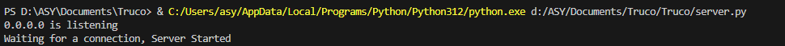
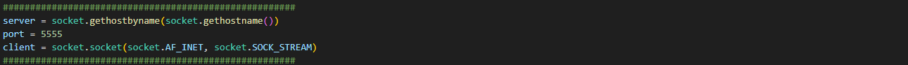
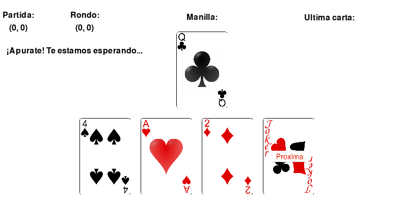

To use the code you will need to quickly set up first.
===============
You'll need to install the pygame package:
<!--  -->
pip install pygame
<!--  -->
Then, you need to run the server.py code on your server computer, you should get the following response:
<!--  -->

<!--  -->
The following step is to change the server's id (right now, it would work in a local network) to your server's public IP:
<!--  -->

<!--  -->
Then you can run the client side code, you will get a windows to enter your pseudo (write it the pess enter):
<!--  -->

<!--  -->
Finally the game itself:
<!--  -->

<!--  -->
Let us note that each hand serves for a BO3 (the score is kept in the round) and then you can make as many hands as you want the score will be kept in party.
<!--  -->
A bug was found, if you both decide to give up (click the "proxima" red joker) it will not resolve the hand as expected.
<!--  -->
I would like to thank Gabrielle for teaching me Truco and the chanel "Tech With Tim" for his really helpful tutorials.